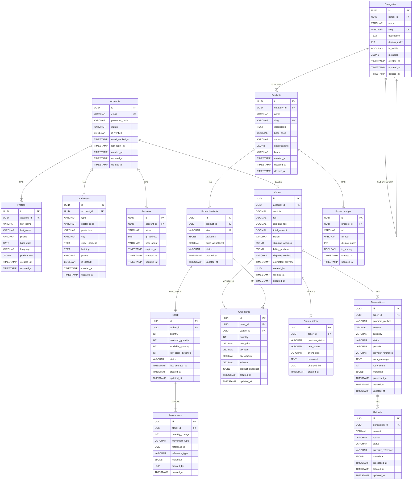

# データベーススキーマ

## エンティティ関係図

```mermaid
erDiagram
    Accounts ||--|{ Profiles : "HAS"
    Accounts ||--|{ Addresses : "HAS"
    Accounts ||--|{ Sessions : "HAS"
    Accounts ||--|{ Orders : "PLACES"
    Categories ||--|{ Categories : "SUBCATEGORY"
    Categories ||--|{ Products : "CONTAINS"
    Products ||--|{ ProductVariants : "HAS"
    Products ||--|{ ProductImages : "HAS"
    ProductVariants ||--|| Stock : "HAS_STOCK"
    Stock ||--|{ Movements : "TRACKS"
    Orders ||--|{ OrderItems : "CONTAINS"
    Orders ||--|{ StatusHistory : "TRACKS"
    ProductVariants ||--|{ OrderItems : "ORDERED_AS"
    Orders ||--|{ Transactions : "HAS"
    Transactions ||--|{ Refunds : "HAS"

    Accounts {
        UUID id PK
        VARCHAR email UK
        VARCHAR password_hash
        VARCHAR status
        BOOLEAN is_verified
        TIMESTAMP email_verified_at
        TIMESTAMP last_login_at
        TIMESTAMP created_at
        TIMESTAMP updated_at
        TIMESTAMP deleted_at
    }

    Profiles {
        UUID id PK
        UUID account_id FK
        VARCHAR first_name
        VARCHAR last_name
        VARCHAR phone
        DATE birth_date
        VARCHAR language
        JSONB preferences
        TIMESTAMP created_at
        TIMESTAMP updated_at
    }

    Addresses {
        UUID id PK
        UUID account_id FK
        VARCHAR type
        VARCHAR postal_code
        VARCHAR prefecture
        VARCHAR city
        TEXT street_address
        TEXT building
        VARCHAR phone
        BOOLEAN is_default
        TIMESTAMP created_at
        TIMESTAMP updated_at
    }

    Sessions {
        UUID id PK
        UUID account_id FK
        VARCHAR token
        INET ip_address
        VARCHAR user_agent
        TIMESTAMP expires_at
        TIMESTAMP created_at
        TIMESTAMP updated_at
    }

    Categories {
        UUID id PK
        UUID parent_id FK
        VARCHAR name
        VARCHAR slug UK
        TEXT description
        INT display_order
        BOOLEAN is_visible
        JSONB metadata
        TIMESTAMP created_at
        TIMESTAMP updated_at
        TIMESTAMP deleted_at
    }

    Products {
        UUID id PK
        UUID category_id FK
        VARCHAR name
        VARCHAR slug UK
        TEXT description
        DECIMAL base_price
        VARCHAR status
        JSONB specifications
        VARCHAR brand
        TIMESTAMP created_at
        TIMESTAMP updated_at
        TIMESTAMP deleted_at
    }

    ProductVariants {
        UUID id PK
        UUID product_id FK
        VARCHAR sku UK
        JSONB attributes
        DECIMAL price_adjustment
        VARCHAR status
        TIMESTAMP created_at
        TIMESTAMP updated_at
    }

    ProductImages {
        UUID id PK
        UUID product_id FK
        VARCHAR url
        VARCHAR alt_text
        INT display_order
        BOOLEAN is_primary
        TIMESTAMP created_at
        TIMESTAMP updated_at
    }

    Stock {
        UUID id PK
        UUID variant_id FK
        INT quantity
        INT reserved_quantity
        INT available_quantity
        INT low_stock_threshold
        VARCHAR status
        TIMESTAMP last_counted_at
        TIMESTAMP created_at
        TIMESTAMP updated_at
    }

    Movements {
        UUID id PK
        UUID stock_id FK
        INT quantity_change
        VARCHAR movement_type
        UUID reference_id
        VARCHAR reference_type
        JSONB metadata
        UUID created_by
        TIMESTAMP created_at
    }

    Orders {
        UUID id PK
        UUID account_id FK
        DECIMAL subtotal
        DECIMAL tax
        DECIMAL shipping_fee
        DECIMAL total_amount
        VARCHAR status
        JSONB shipping_address
        JSONB billing_address
        VARCHAR shipping_method
        TIMESTAMP estimated_delivery
        UUID created_by
        TIMESTAMP created_at
        TIMESTAMP updated_at
    }

    OrderItems {
        UUID id PK
        UUID order_id FK
        UUID variant_id FK
        INT quantity
        DECIMAL unit_price
        DECIMAL tax_rate
        DECIMAL tax_amount
        DECIMAL subtotal
        JSONB product_snapshot
        TIMESTAMP created_at
        TIMESTAMP updated_at
    }

    StatusHistory {
        UUID id PK
        UUID order_id FK
        VARCHAR previous_status
        VARCHAR new_status
        VARCHAR event_type
        TEXT comment
        UUID changed_by
        TIMESTAMP created_at
    }

    Transactions {
        UUID id PK
        UUID order_id FK
        VARCHAR payment_method
        DECIMAL amount
        VARCHAR currency
        VARCHAR status
        VARCHAR provider
        VARCHAR provider_reference
        TEXT error_message
        INT retry_count
        JSONB metadata
        TIMESTAMP processed_at
        TIMESTAMP created_at
        TIMESTAMP updated_at
    }

    Refunds {
        UUID id PK
        UUID transaction_id FK
        DECIMAL amount
        VARCHAR reason
        VARCHAR status
        VARCHAR provider_reference
        JSONB metadata
        TIMESTAMP processed_at
        TIMESTAMP created_at
        TIMESTAMP updated_at
    }
```
